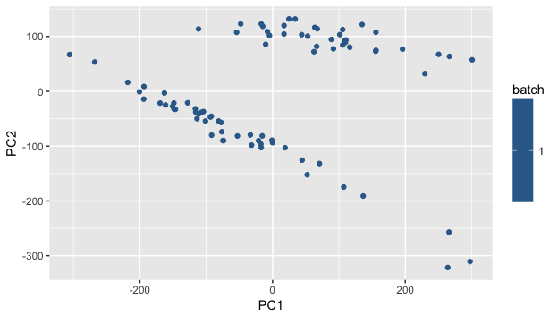

# rinfino

The goal of rinfino is to provide helper-functions and (eventually) an interface to [infino](https://github.com/hammerlab/infino). Infino is a computational biology tool that estimates the composition of immune infiltrate in a bulk-biopsy sample given RNAseq data using a Bayesian hierarchical mixture model. 

## Installation

You can install rinfino from github with:

``` r
# install.packages("devtools")
devtools::install_github("hammerlab/rinfino")
```

Since this package makes use of Bioconductor packages, you may prefer to use biocLite to install from github:

```r
# source("https://bioconductor.org/biocLite.R")
biocLite('hammerlab/rinfino')
```

## Example

Load an example dataset, filter to genes that are expressed in at least one sample & run PCA:

``` r
library(dplyr)
library(rinfino)
data("rcctils_expression")

pca_results <- 
  rcctils_expression %>% 
  filter_expdata(fun = function(x) {max(x)>0}) %>% 
  run_pca(use_ggplot=T)
```


Alternatively, you might want to load data from multiple sources (say, TCGA & a sample of isolated tils), filter to marker genes & run combat:

``` r
library(dplyr)
library(rinfino)

path_to_rcctils <- system.file("testdata", "rcctils_expression_matrix.tsv.gz", package = "rinfino")
path_to_tcgaexp <- system.file("testdata", "tcga_expression_matrix.tsv.gz", package = "rinfino")

combat_results <-
  load_all_expdata(c(path_to_rcctils, path_to_tcgaexp), batch = c('rcctils', 'tcgaexp')) %>%
  filter_expdata() %>%  ## filter to expressed genes
  run_pca(use_ggplot=F) %>% ## run_pca
  filter_genes() %>%  ## filter to marker genes
  run_combat()
```
